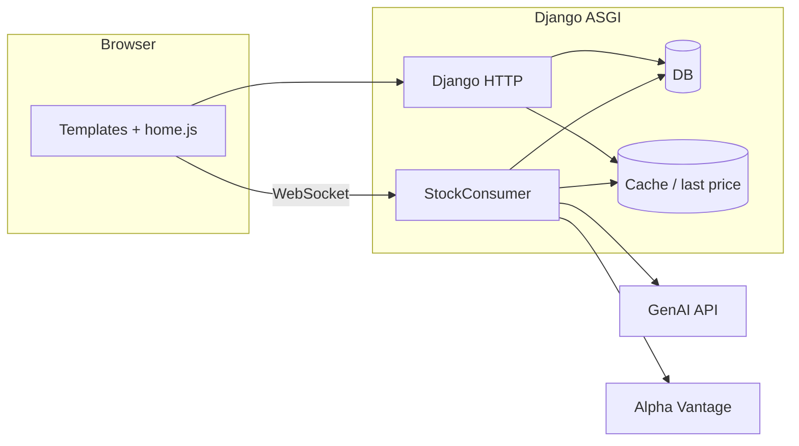

# Alien Stock Sim (s26_team_4)

**Team:** Davis Germain, Leyu Ding, Yunqi Dong  

Course project for CMU web apps (Spring 2026). It’s a fake stock game: sign in with Google, buy and sell shares in made-up companies, watch prices move on a live chart, and try to climb the leaderboard. You can also follow other players and DM people once you follow each other.

**Live site:** the course deployment (team4.cmu-webapps.com) has been retired. To see it running, follow **[Running it locally](#running-it-locally)** below.

---

## What it does

- **Landing + auth:** Google OAuth through [django-allauth](https://docs.allauth.org/); unauthenticated visitors see the landing page, logged-in users go to `/home`.
- **Trading desk (`/home`):** WebSocket feed at `/ws/alienstocksim/` drives the ticker and [Chart.js](https://www.chartjs.org/) chart. News lines scroll in the sidebar; trades go through a modal and hit `POST /trade/`.
- **Prices:** The `StockConsumer` (Channels) simulates prices, mixes in occasional real-world quote *changes* from Alpha Vantage (mapped to our silly company names), and stores recent points in `PriceCache`. Last prices for HTTP are read from Django’s cache (`alienstocksim.pricing`).
- **Headlines:** Batches of headlines come from the **Google GenAI** API (Gemini, JSON). They’re saved as `NewsItem` rows and nudge prices when they land—see **AI usage** below.
- **Profiles:** Net worth, holdings, followers/following, follow/unfollow, search on your own profile, and a small leaderboard among you and people you follow.
- **Messages:** Inbox and threads under `/messages/`; only **mutual followers** can chat. Unread counts power the nav badge; threads can poll for new messages; there’s a service worker for optional DM notifications.

---

## AI usage

**1. In the product**  
Headlines are generated server-side with **Google Gemini** (`gemini-2.5-flash`) via `generate_headline_batch()` in `views.py`. The model returns JSON; we parse it, save `NewsItem` records, and the WebSocket consumer applies severity/direction as percentage moves on the simulated prices. You need valid Google GenAI credentials (see [Google Gen AI SDK](https://googleapis.github.io/python-genai/) docs) in the environment your app runs in.

**Davis AI Usage**

I used AI for 3 major purposes:

Understanding how to use various APIs, as well as learning how to use APIs as a whole,
since this was my first project using them.

Relearning the more intricate features of JS (and service workers), since I did not know JS before this class.

Debugging JS code

**Yunqi AI Usage**

I used AI to learn how to design and implement the direct messaging system and unread message logic.

learning how to make leaderboard functionality, including querying, ranking users, and optimizing database queries.

Debugging Django, template, and backend-related issues encountered during development.

**Leyu AI Usage**

Content wise, I used AI to learn how to setup websockets and how to make API calls, I also used AI to figure out 
how to get everything running concurrently when deployed (extreme crunch time), and stuff relating to
channels and layers, some of the more minor content stuff that I used AI for was the popup modal.

AI was also used a lot when debugging in general, especially when it comes to more obscure errors like
the cache resetting to it's default value constantly when deployed, I learned a lot of neat coding
tricks while using AI to debug like using the ? and ?? operator. 

Lastly, I used AI to figure out what API to use. At first I was using MASSIVE (I think they rebranded to something else),
but they were pretty rate limited I think, so I used AI to find an alternative that has more free calls.

---

## How it’s put together

Django lives under `webapps/` (`settings`, root `urls`, `asgi.py` for HTTP + WebSockets). Game logic, templates, and static files live in `alienstocksim/`. Regular requests hit Django views; the trading UI opens a WebSocket to `StockConsumer`, which runs the price loop, headline loop, and broadcasts on the `news_feed` channel group.



**Stack:** Django 5.2+, **Daphne** for ASGI, **Channels** for WebSockets, **allauth** + Google, default **SQLite** in dev (`mysqlclient` in `requirements.txt` if you point Django at MySQL), **requests** for Alpha Vantage, **google-genai** for headlines.

---

## Models 

- `Profile` — one-to-one with `User`, follower graph, starting cash.
- `StockEntry` — holdings per company; `cost_basis_paid` for average cost; unique on `(profile, company)`.
- `PriceCache` — JSON price history and remaining float per company.
- `NewsItem` — persisted headlines for history and for clients that connect late.
- `DirectMessage` — DMs with `read_at` for unread/read.

Trades use `select_for_update()` inside `transaction.atomic()` with retries on SQLite lock errors.

Fictional tickers map to real symbols in `StockConsumer.COMPANY_MAP` (e.g. Pear / Googlin / …). Keep `TRADE_COMPANY` in `alienstocksim/pricing.py` aligned with the default company in `static/alienstocksim/home.js` if you change defaults.

---

## Repo layout

```
manage.py
requirements.txt
config.ini          # gitignored — Django secret (see setup)
.env                # gitignored - Stores Gemini & Google keys
webapps/            # project: settings, urls, asgi, wsgi
alienstocksim/      # app: models, views, consumers, routing, static, templates
sw.js               # service worker (notifications)
```

---

## Running it locally

The repo ships a local settings module (`webapps/settings_local.py`) that swaps the
production MySQL + Redis stack for **SQLite** and an **in-memory channel layer**, so no
external services are needed. Everything below is copy-paste.

**1. Install dependencies**

```bash
python3 -m venv venv
source venv/bin/activate          # Windows: venv\Scripts\activate
pip install -r requirements.txt
```

**2. Create the two config files** (both are gitignored — templates are provided)

```bash
cp config.ini.example config.ini
cp .env.example .env
# then generate a Django secret key and paste it into config.ini:
python -c "from django.core.management.utils import get_random_secret_key; print(get_random_secret_key())"
```

The app **boots and shows the landing page with `.env` left blank**. Filling in the keys
unlocks the parts that call external services (see [What you need keys for](#what-you-need-keys-for)).

**3. Migrate and run** (all commands use the local settings module)

```bash
export DJANGO_SETTINGS_MODULE=webapps.settings_local   # Windows: set DJANGO_SETTINGS_MODULE=webapps.settings_local
python manage.py migrate
python manage.py createcachetable
python manage.py runserver 8000
```

Open **http://localhost:8000**. `runserver` here is Daphne (it's in `INSTALLED_APPS`), so
WebSockets, the live price chart, and the news feed all work.

### What you need keys for

| Feature | Works without keys? | Key needed |
|---|---|---|
| Landing page, code, DB models | ✅ yes | — |
| Live price chart + WebSocket feed | ✅ yes | — |
| **Sign in with Google** → the trading desk | ❌ no | `GOOGLE_CLIENT_ID` / `GOOGLE_CLIENT_SECRET` in `.env` |
| AI news headlines | ❌ no | `GEMINI_API_KEY` in `.env` |
| Real-world price nudges | optional | `ALPHAVANTAGE_API_KEY` in `.env` |

To enable Google login, create a **Web application** OAuth client at
[console.cloud.google.com/auth/clients](https://console.cloud.google.com/auth/clients),
add `http://localhost:8000/accounts/google/login/callback/` as an authorized redirect URI,
and put the client id/secret in `.env`. In Testing mode, add your Google account under
**Audience → Test users**.


