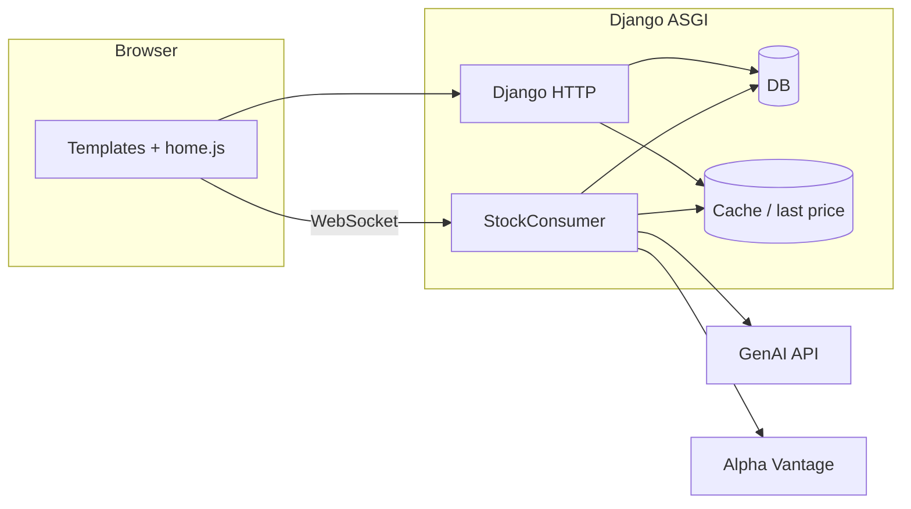

# Alien Stock Sim (s26_team_4)

**Team:** Davis Germain, Leyu Ding, Yunqi Dong  

Course project for CMU web apps (Spring 2026). It’s a fake stock game: sign in with Google, buy and sell shares in made-up companies, watch prices move on a live chart, and try to climb the leaderboard. You can also follow other players and DM people once you follow each other.

**Live site:** [team4.cmu-webapps.com](https://team4.cmu-webapps.com)

---

## What it does

- **Landing + auth:** Google OAuth through [django-allauth](https://docs.allauth.org/); unauthenticated visitors see the landing page, logged-in users go to `/home`.
- **Trading desk (`/home`):** WebSocket feed at `/ws/alienstocksim/` drives the ticker and [Chart.js](https://www.chartjs.org/) chart. News lines scroll in the sidebar; trades go through a modal and hit `POST /trade/`.
- **Prices:** The `StockConsumer` (Channels) simulates prices, mixes in occasional real-world quote *changes* from Alpha Vantage (mapped to our silly company names), and stores recent points in `PriceCache`. Last prices for HTTP are read from Django’s cache (`alienstocksim.pricing`).
- **Headlines:** Batches of headlines come from the **Google GenAI** API (Gemini, JSON). They’re saved as `NewsItem` rows and nudge prices when they land—see **AI usage** below.
- **Profiles:** Net worth, holdings, followers/following, follow/unfollow, search on your own profile, and a small leaderboard among you and people you follow.
- **Messages:** Inbox and threads under `/messages/`; only **mutual followers** can chat. Unread counts power the nav badge; threads can poll for new messages; there’s a service worker for optional DM notifications.

---

## AI usage

**1. In the product**  
Headlines are generated server-side with **Google Gemini** (`gemini-2.5-flash`) via `generate_headline_batch()` in `views.py`. The model returns JSON; we parse it, save `NewsItem` records, and the WebSocket consumer applies severity/direction as percentage moves on the simulated prices. You need valid Google GenAI credentials (see [Google Gen AI SDK](https://googleapis.github.io/python-genai/) docs) in the environment your app runs in.

**Davis AI Usage**
I used AI for 3 major purposes:
Understanding how to use various APIs, as well as learning how to use APIs as a whole,
since this was my first project using them.

Relearning the more intricate features of JS (and service workers), since I did not know JS before this class.

Debugging JS code

**Yunqi AI Usage**

**Leyu AI Usage**

---

## How it’s put together

Django lives under `webapps/` (`settings`, root `urls`, `asgi.py` for HTTP + WebSockets). Game logic, templates, and static files live in `alienstocksim/`. Regular requests hit Django views; the trading UI opens a WebSocket to `StockConsumer`, which runs the price loop, headline loop, and broadcasts on the `news_feed` channel group.



**Stack:** Django 5.2+, **Daphne** for ASGI, **Channels** for WebSockets, **allauth** + Google, default **SQLite** in dev (`mysqlclient` in `requirements.txt` if you point Django at MySQL), **requests** for Alpha Vantage, **google-genai** for headlines.

---

## Models 

- `Profile` — one-to-one with `User`, follower graph, starting cash.
- `StockEntry` — holdings per company; `cost_basis_paid` for average cost; unique on `(profile, company)`.
- `PriceCache` — JSON price history and remaining float per company.
- `NewsItem` — persisted headlines for history and for clients that connect late.
- `DirectMessage` — DMs with `read_at` for unread/read.

Trades use `select_for_update()` inside `transaction.atomic()` with retries on SQLite lock errors.

Fictional tickers map to real symbols in `StockConsumer.COMPANY_MAP` (e.g. Pear / Googlin / …). Keep `TRADE_COMPANY` in `alienstocksim/pricing.py` aligned with the default company in `static/alienstocksim/home.js` if you change defaults.

---

## Repo layout

```
manage.py
requirements.txt
config.ini          # gitignored — Django secret (see setup)
webapps/            # project: settings, urls, asgi, wsgi
alienstocksim/      # app: models, views, consumers, routing, static, templates
sw.js               # service worker (notifications)
```

---

## Running it locally

```bash
python3 -m venv venv
source venv/bin/activate    # Windows: venv\Scripts\activate
pip install -r requirements.txt
```

Add `config.ini` at the repo root:

```ini
[Django]
secret = <your-secret-key>
```

Run migrations, then start with **Daphne** (WebSockets won’t behave like production on plain `runserver`):

```bash
python manage.py migrate
daphne -b 0.0.0.0 -p 8000 webapps.asgi:application
```

Configure Google OAuth in Django admin (Sites + social app) for localhost and production. Add GenAI credentials for your machine. For a static build: `python manage.py collectstatic`.


