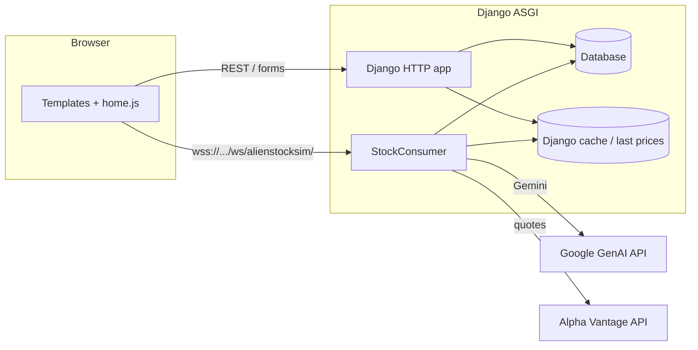

# Alien Stock Sim (s26_team_4)

Team Members: Davis Germain, Leyu Ding, Yunqi Dong

**Alien Stock Sim** is a browser-based paper-trading game built for CMU’s web applications course. Players sign in with Google, trade shares in fictional companies whose prices react to synthetic news and (lightly) to real market signals, and compete on a global net-worth leaderboard. Direct messaging is available between mutually following players.

**Production deployment:** [https://team4.cmu-webapps.com](https://team4.cmu-webapps.com)

---

## Features

- **Google sign-in** via [django-allauth](https://docs.allauth.org/) (social account flow on the landing page).
- **Live trading desk** (`/home`): multi-company ticker, [Chart.js](https://www.chartjs.org/) price chart, rolling news feed, buy/sell with confirmation modal, optional browser notifications for new DMs (service worker).
- **Real-time transport**: [Django Channels](https://channels.readthedocs.io/) WebSocket at `/ws/alienstocksim/` pushes price ticks and headlines to all connected clients; HTTP views read last prices from Django’s cache layer (`alienstocksim.pricing`).
- **Synthetic news**: batched headlines are generated with the **Google GenAI** API (Gemini, JSON mode), persisted as `NewsItem` rows, and applied as configurable percentage shocks to the in-game price engine.
- **Market anchor**: periodically, percentage changes from **Alpha Vantage** “global quote” data for real symbols are blended into the simulation (mapped to fictional company names).
- **Profiles** (`/profile`, `/profile/<username>`): liquid cash, live net worth (cash + marked-to-market holdings), holdings table with average cost, followers/following, follow/unfollow, user search (own profile), and a small “friends” leaderboard among the viewed user and accounts they follow.
- **Direct messages** (`/messages/`, `/messages/<username>/`): only **mutual followers** may chat; read receipts via `read_at`; inbox sorted by latest activity; thread polling endpoint for incremental updates; nav unread badge via context processor + periodic JSON poll.

---

## Architecture


| Layer                | Responsibility                                                                                                         |
| -------------------- | ---------------------------------------------------------------------------------------------------------------------- |
| `**webapps/`**       | Django project: `settings.py`, root `urls.py`, `asgi.py` (HTTP + WebSocket routing), `wsgi.py`.                        |
| `**alienstocksim/**` | Main app: models, views, Channel consumer, WebSocket URL routing, static assets, templates, forms, context processors. |


High-level request flow:

- **HTTP**: Django’s ASGI stack serves normal views (templates + JSON endpoints for trading, stats, leaderboard, messages).
- **WebSocket**: `AuthMiddlewareStack` → `alienstocksim.routing` → `StockConsumer`, which runs asyncio loops for headline generation and price simulation and uses the channel layer to **broadcast** `stock_price` and `news_headline` events to the `news_feed` group.




---

## Technology stack


| Area                       | Choice                                                                                                                           |
| -------------------------- | -------------------------------------------------------------------------------------------------------------------------------- |
| Framework                  | **Django ≥ 5.2**                                                                                                                 |
| Async server               | **Daphne** (ASGI), with `channels` in `INSTALLED_APPS`                                                                           |
| Real-time                  | **Django Channels** (`AsyncWebsocketConsumer`), `websockets` / channel layers                                                    |
| Auth                       | **django-allauth** + **Google** provider; `django.contrib.sites` (`SITE_ID = 1`)                                                 |
| Database (default in repo) | **SQLite** (`db.sqlite3`)                                                                                                        |
| Optional DB driver         | **mysqlclient** (listed in requirements for MySQL-capable deployments)                                                           |
| AI headlines               | **google-genai** client, `gemini-2.5-flash`, structured JSON output                                                              |
| External quotes            | **requests** + Alpha Vantage HTTP API                                                                                            |
| Front-end chart            | **Chart.js** (CDN on home page)                                                                                                  |
| Config                     | `**python-dotenv`** (`load_dotenv` in settings); `**configparser**` reads `**config.ini**` for `SECRET_KEY` (file is gitignored) |


---

## Domain model (summary)

- `**Profile**`: one-to-one with `User`; `ManyToManyField` to self for followers; `liquid_money` (integer cents-style whole dollars in logic paths that format as currency).
- `**StockEntry**`: per `(profile, company)` holding with `quantity`, `cost_basis_paid`, optional `price_cache` FK; `unique_together` on `(profile, company)`.
- `**PriceCache**`: per company, `datapoints` JSON (timestamp + price in cents), `remaining` shares pool for the tradable float.
- `**NewsItem**`: stored headlines/blurbs/direction/severity for history and replay to new WebSocket clients.
- `**DirectMessage**`: sender/recipient FKs to `User`, `body`, `created_at`, `read_at`; indexes support inbox and unread queries.

Trading (`POST /trade/`) uses `**select_for_update()**` inside `**transaction.atomic()**` with retries on SQLite lock errors to reduce race conditions on balances, quantities, and the shared float.

---

## Fictional companies and ticker map

In-game names are decoupled from real tickers in `StockConsumer.COMPANY_MAP` (e.g. **Pear** ← AAPL-style quote, **Googlin**, **Fire Rage Inc.**, **BenefitCo**). The primary chart/trading default in the static client is aligned with `**TRADE_COMPANY`** in `alienstocksim/pricing.py` (keep these in sync when changing the default ticker).

---

## Project layout

```
manage.py
requirements.txt
config.ini          # not in git; required locally for SECRET_KEY (see below)
webapps/
  settings.py
  urls.py
  asgi.py
  wsgi.py
alienstocksim/
  models.py
  views.py
  consumers.py
  routing.py
  pricing.py
  forms.py
  context_processors.py
  admin.py
  static/alienstocksim/   # CSS, JS (home, profile, messages, landing, theme)
  templates/alienstocksim/
sw.js                     # service worker (DM notifications)
```

---

## Local setup

### 1. Python environment

```bash
python3 -m venv venv
source venv/bin/activate   # Windows: venv\Scripts\activate
pip install -r requirements.txt
```

### 2. Configuration files

Create `**config.ini**` at the repository root (this path is gitignored). Minimal example:

```ini
[Django]
secret = your-django-secret-key-here
```

Create `**.env**` in the project root if your environment needs it (also gitignored). The app uses `**google.genai.Client()**` for headline generation; configure credentials the way your deployment expects (e.g. API key or ADC as per [Google Gen AI SDK](https://googleapis.github.io/python-genai/) documentation).

Configure **django-allauth** Google OAuth in the Django admin (Sites, social applications) as usual for local `localhost` and production hosts.

### 3. Database

```bash
python manage.py migrate
python manage.py createsuperuser   # optional, for /admin/
```

The default configuration uses **SQLite**. `requirements.txt` includes **mysqlclient** for teams that point `DATABASES['default']` at MySQL on a shared host.

### 4. Run the app

Because the trading desk relies on **WebSockets**, use an **ASGI** server (not only `runserver` in older habits):

```bash
daphne -b 0.0.0.0 -p 8000 webapps.asgi:application
```

For quick checks, Django’s dev server can still serve many HTTP routes, but WebSocket + Channels behavior is intended to run under **Daphne** (or another ASGI server).

Collect static files for production-style serving:

```bash
python manage.py collectstatic
```

---

## Important configuration notes

- `**ALLOWED_HOSTS**` in `webapps/settings.py` includes `**team4.cmu-webapps.com**` alongside local dev hosts.
- `**CHANNEL_LAYERS**` uses `**InMemoryChannelLayer**`. That is fine for a single process; for multi-worker or multi-machine deployments, switch to **Redis** (the repo already lists `**channels_redis`**) so WebSocket groups and broadcasts stay consistent.
- `**DEBUG**` is currently `**True**` in settings; tighten this and `SECRET_KEY` handling for any long-lived public deployment.
- **Last-traded prices** for HTTP views are stored in Django’s **default cache** (`pricing.set_last_price` / `get_last_price`). With default settings this is process-local memory cache—consistent with a single Daphne process, but worth revisiting if you scale out.

---

## API surface (selected)


| Method    | Path                                                | Purpose                                                           |
| --------- | --------------------------------------------------- | ----------------------------------------------------------------- |
| GET       | `/`                                                 | Landing; redirects authenticated users to `/home`.                |
| GET       | `/home`                                             | Trading desk (login required).                                    |
| GET/POST  | `/profile`, `/profile/<username>`                   | Profile and follow graph.                                         |
| POST      | `/follow/`                                          | Follow or unfollow (`username`, `action`, optional `next`).       |
| GET       | `/messages/`, `/messages/<username>/`               | Inbox and thread (mutual followers).                              |
| GET       | `/messages/<username>/poll/`                        | JSON poll for new messages after `after_id`.                      |
| GET       | `/unread_messages/`                                 | JSON unread count + preview for nav badge.                        |
| POST      | `/trade/`                                           | JSON body: `company`, `action` (`buy`/`sell`), `price`, `amount`. |
| GET       | `/stock_stats/<company>/`, `/user_stats/<company>/` | Aggregate and per-user stats for the desk.                        |
| GET       | `/api/leaderboard/`                                 | JSON global leaderboard rows.                                     |
| WebSocket | `/ws/alienstocksim/`                                | Live prices, headlines, price history payloads.                   |


CSRF applies to session-based POSTs (e.g. messages, follow); the trade endpoint expects a valid session and appropriate headers from the front end’s `fetch` usage.

---

## Team

**CMU Web Apps — Team 4** (Spring 2026). Repository: `s26_team_4`.

---

## License / course use

This repository is maintained for an academic web applications project. Third-party libraries are subject to their respective licenses.